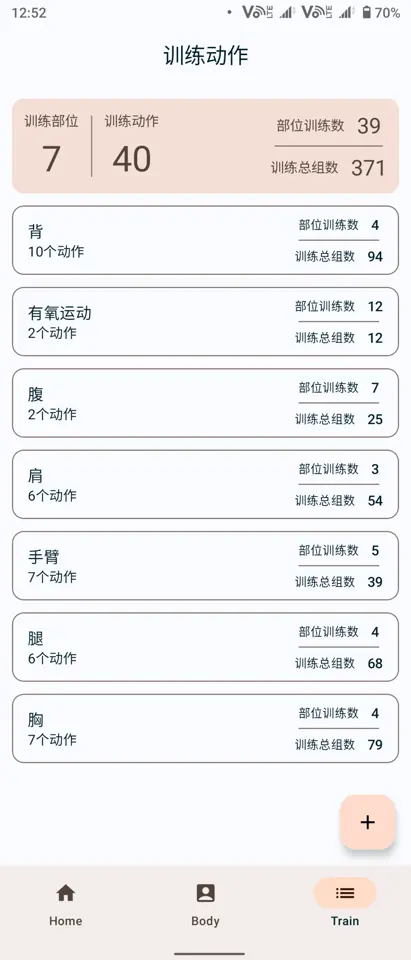
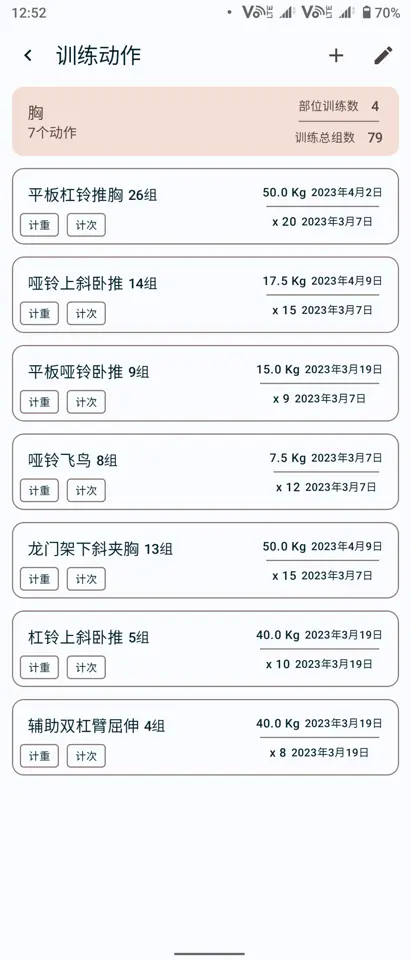
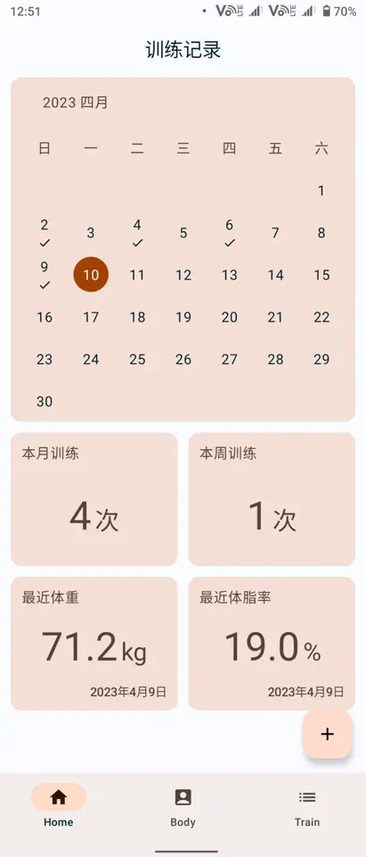
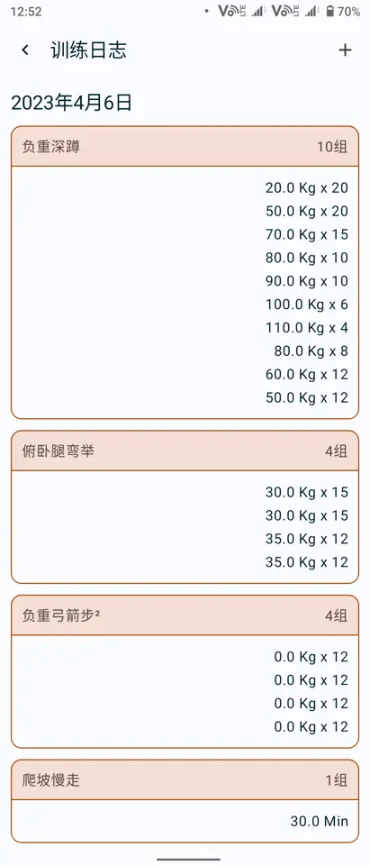
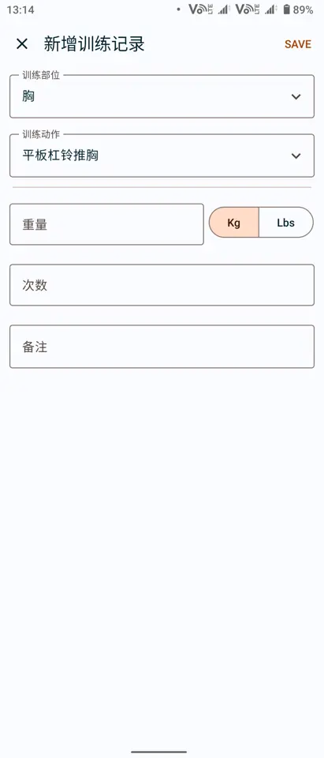
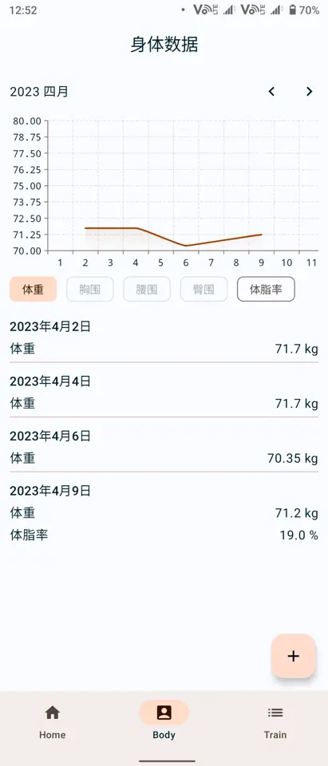
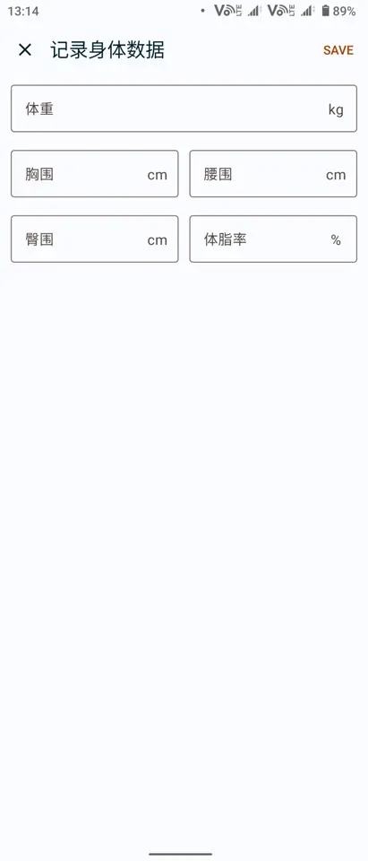

# DailyFitness app

[Readme English](./README.md)
[简体中文](./README_cn.md)

This repo is an Android application for recording daily fitness workout and body data.

## Function

This app supports following functions:

* Create and save your own train parts and actions;
* Record your daily workouts;
* Record your body datas like weight;
* Statics and show your workouts;
* Show your body datas in line chart.

### Train actions

You can create and save your own train action, which is categoried in train group.

And show workout counts, maximum weight according to your workout records.

### Workout records

Record your daily workouts and track how you train everyday.

### Body record

Save your body data in detail.

## Compilation

This repo is developed under:

* Android Studio Giraffe Canarty 8 or later;
* JDK 17;
* gradle 8.0
* APG 8.1.0-alpha8

This repo depends on:

* Jetpack Compose
* Android Room
* Android Hilt
* Kotlin coroutine
* [vico](https://github.com/patrykandpatrick/vico)

Refer to [config file](gradle/libs.versions.toml) for more details.

Some custom widgets are inspired by the following blogs:

* [DropdownMenu](https://proandroiddev.com/improving-the-compose-dropdownmenu-88469b1ef34)
* [SegmentButton](https://medium.com/@manojbhadane/hello-everyone-558290eb632e)

## Disclaimer

* The software is only for personal learning and communication, commercial usage is strickly prohibited.
* The software will only save user's data in local storage, and will not upload or share with others.

## License

This repo is open sourced under [GPLv3](./LICENSE) license.
