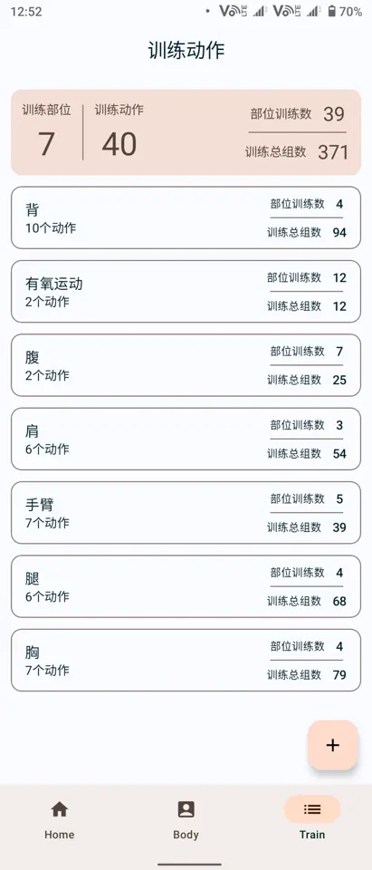
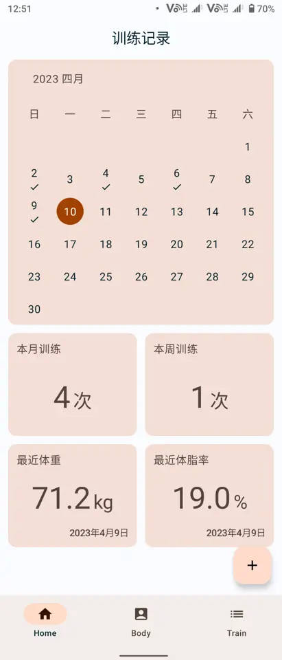
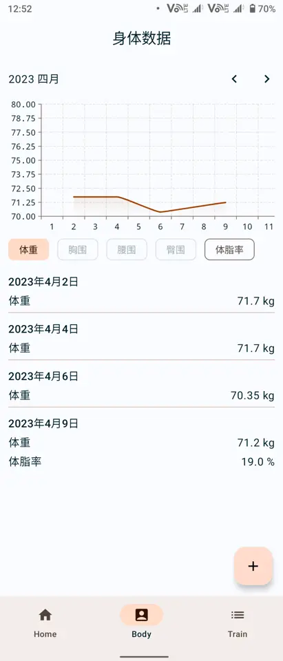
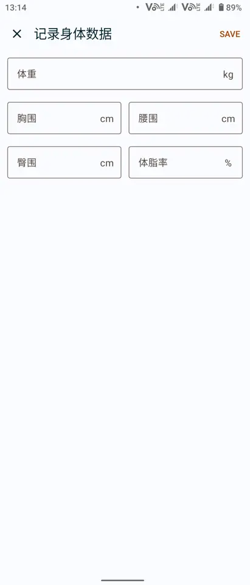

# 健身日志 app

此项目是用于记录日常锻炼项目和身体情况测量数据的Android应用。

## 功能

支持功能：

* 创建和记录训练组、训练动作；
* 记录每次锻炼的详细信息；
* 记录体重、三围、体脂等身体测量信息；
* 统计、显示训练信息；
* 显示身体测量信息折现图。

### 训练动作

可以创建、记录属于自己的训练动作，并按动作组分类。

并且根据记录的锻炼信息，统计显示各训练动作的使用次数、最大重量、最大单组次数等统计信息。

### 锻炼记录

可以记录你每日的锻炼信息，精确记录你的运动轨迹。

### 身体记录

详细记录你的每日身体数据，用于分析身体变化，制定锻炼计划。

## 编译开发

此项目编译环境如下：

* Android Studio Giraffe Canary 8 或以上；
* JDK 17；
* gradle 8.0
* APG 8.1.0-alpha8

此项目依赖以下库：

* Jetpack Compose
* Android Room
* Android Hilt
* Kotlin coroutine
* [vico](https://github.com/patrykandpatrick/vico)

详细依赖列表可在[此处](gradle/libs.versions.toml)获得。

部分控件受到了一些博客文章的启发，进行了参考与定制

* [DropdownMenu](https://proandroiddev.com/improving-the-compose-dropdownmenu-88469b1ef34)
* [SegmentButton](https://medium.com/@manojbhadane/hello-everyone-558290eb632e)

## 免责声明

* 项目仅供个人学习与交流使用，不可用于商业用途。
* 项目仅将用户数据保存于本地，不会上传、与他人分享用户信息。

## 开源许可

项目基于[GPLv3](./LICENSE)进行开源。
